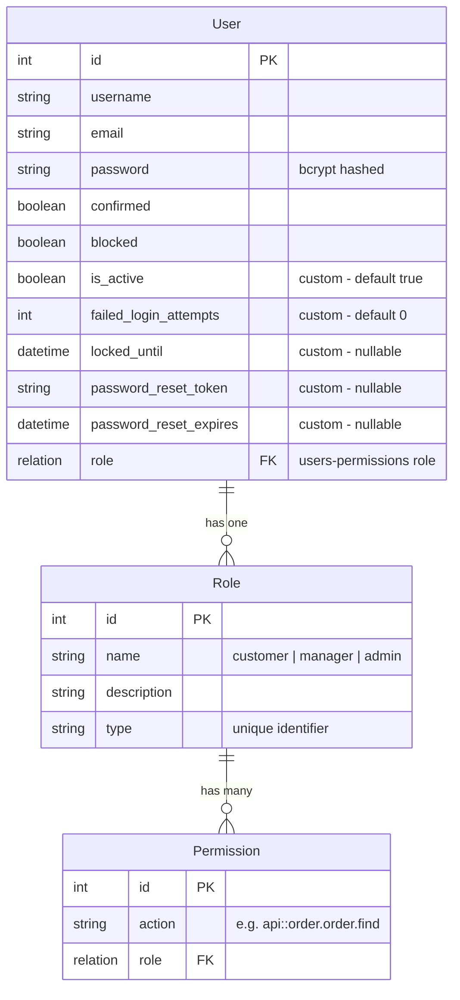

# Design Document: Strapi Auth System

## Overview

This design implements authentication and authorization for the existing Strapi 5 e-commerce backend (`orders-crm`). The system leverages Strapi's built-in `@strapi/plugin-users-permissions` plugin (already installed) to provide JWT-based authentication, role-based access control (Customer, Manager, Admin), and endpoint protection for the existing order, product, order-item, and analytics APIs.

The key design decision is to build on top of Strapi's native users-permissions plugin rather than implementing a custom auth system from scratch. This gives us battle-tested JWT handling, user management, and role infrastructure out of the box, while we extend it with custom policies, middleware, and lifecycle hooks for our specific RBAC and security requirements.

## Architecture

```mermaid
graph TB
    Client[Frontend Client] -->|HTTP + JWT| MW[Strapi Middleware Stack]
    MW --> RL[Rate Limiter Middleware]
    RL --> Auth[Auth Middleware]
    Auth --> Policy[Route Policies]
    Policy --> Controller[API Controllers]
    
    subgraph "Strapi Users-Permissions Plugin"
        UP_Auth[/api/auth/local]
        UP_Register[/api/auth/local/register]
        UP_Me[/api/users/me]
        UP_Users[/api/users]
    end
    
    subgraph "Custom Extensions"
        IsOwner[isOwner Policy]
        IsRole[isRole Policy]
        RateLimit[Rate Limit Middleware]
        AuditLog[Audit Logger]
    end
    
    subgraph "Existing APIs"
        OrderAPI[Order API]
        ProductAPI[Product API]
        AnalyticAPI[Analytics API]
        OrderItemAPI[Order-Item API]
    end
    
    Policy --> IsOwner
    Policy --> IsRole
    Auth --> UP_Auth
    Auth --> UP_Register
    Controller --> OrderAPI
    Controller --> ProductAPI
    Controller --> AnalyticAPI
    Controller --> OrderItemAPI
```

### Design Decisions

1. **Use `@strapi/plugin-users-permissions` as the foundation**: Already a dependency in `package.json`. Provides JWT issuance, user CRUD, role definitions, and authentication middleware. We avoid reinventing the wheel.

2. **Custom policies over custom middleware for authorization**: Strapi policies are the idiomatic way to enforce per-route access rules. We create reusable policies (`isOwner`, `isRole`) that can be composed on any route.

3. **Extend the User content type**: Add fields like `is_active`, `failed_login_attempts`, `locked_until` to the existing `plugin::users-permissions.user` schema via Strapi's content-type extension mechanism.

4. **Custom routes replace default core routes**: For order, product, and analytics APIs, we replace the default open routes with custom route files that attach authentication and authorization policies.

5. **Rate limiting as global middleware**: Implemented as a Strapi middleware that tracks login attempts per IP/email, applied specifically to auth endpoints.

## Components and Interfaces

### 1. Plugin Configuration (`config/plugins.ts`)

Configures the `users-permissions` plugin with JWT settings, role definitions, and registration defaults.

```typescript
// config/plugins.ts
export default ({ env }) => ({
  'users-permissions': {
    config: {
      jwt: {
        expiresIn: env('JWT_EXPIRATION', '24h'),
      },
      register: {
        allowedFields: ['username', 'email', 'password'],
      },
    },
  },
});
```

### 2. User Schema Extension (`src/extensions/users-permissions/content-types/user/schema.json`)

Extends the default user model with auth-specific fields.

```typescript
// Additional attributes on plugin::users-permissions.user
{
  "is_active": { "type": "boolean", "default": true },
  "failed_login_attempts": { "type": "integer", "default": 0 },
  "locked_until": { "type": "datetime", "default": null },
  "password_reset_token": { "type": "string" },
  "password_reset_expires": { "type": "datetime" }
}
```

### 3. Custom Policies

#### `src/policies/is-authenticated.ts`
Verifies JWT token is present and valid. Rejects with 401 if missing/invalid.

#### `src/policies/is-role.ts`
Factory policy that checks if the authenticated user has one of the allowed roles. Used as: `{ name: 'global::is-role', config: { roles: ['admin', 'manager'] } }`.

#### `src/policies/is-owner.ts`
For customer-scoped endpoints (e.g., orders). Verifies the authenticated user owns the requested resource. Managers and Admins bypass this check.

#### `src/policies/is-admin.ts`
Shorthand policy that checks for the Admin role specifically.

### 4. Rate Limiting Middleware (`src/middlewares/rate-limit.ts`)

In-memory rate limiter for auth endpoints. Tracks attempts by IP + email combination. Configurable via environment variables (`MAX_LOGIN_ATTEMPTS`, `ACCOUNT_LOCK_DURATION`).

### 5. Audit Logger (`src/utils/audit-logger.ts`)

Utility that logs security-relevant events (login success/failure, role changes, account deactivation) to Strapi's logger with structured metadata.

### 6. Bootstrap Script (`src/index.ts` - bootstrap function)

On application startup:
- Creates default roles (Customer, Manager, Admin) if they don't exist
- Sets default permissions for each role
- Ensures at least one Admin user exists

### 7. Protected Route Files

Each existing API gets a new custom route file that applies policies:

| API | Route | Auth Required | Roles Allowed | Owner Check |
|-----|-------|--------------|---------------|-------------|
| Product | `GET /products` | No | Public | No |
| Product | `POST/PUT/DELETE /products` | Yes | Manager, Admin | No |
| Order | `GET /orders` | Yes | Customer (own), Manager, Admin (all) | Yes |
| Order | `POST /orders/place` | Yes | Customer, Manager, Admin | No |
| Order | `PUT /orders/:id/replace` | Yes | Manager, Admin | No |
| Analytics | `GET /analytic/*` | Yes | Admin | No |
| Order-Item | All | Yes | Manager, Admin | No |

### 8. Auth Controller Extensions (`src/extensions/users-permissions/controllers/auth.ts`)

Extends the default auth controller to:
- Check `is_active` and `locked_until` before allowing login
- Increment `failed_login_attempts` on failure
- Reset `failed_login_attempts` on success
- Handle password change with current password verification

## Data Models

### Extended User Model

The existing `plugin::users-permissions.user` is extended with:



### Role Definitions

| Role | Type Key | Orders | Products | Analytics | Users |
|------|----------|--------|----------|-----------|-------|
| Customer | `customer` | Own only (CRUD) | Read only | None | Own profile |
| Manager | `manager` | All (CRUD) | All (CRUD) | None | None |
| Admin | `admin` | All (CRUD) | All (CRUD) | All (Read) | All (CRUD) |

### Existing Content Types (unchanged)

- **Order**: `customer_name`, `customer_phone`, `address`, `orderStatus`, `total_price`, `items[]`
- **Product**: `sku`, `name`, `price`, `stock`, `is_active`, `order_items[]`
- **Order-Item**: `order`, `product`, `quantity`, `unit_price`
- **Analytic**: Virtual type for custom analytics routes

### API Endpoints

#### Authentication (provided by users-permissions plugin)
- `POST /api/auth/local` — Login with email/password, returns JWT
- `POST /api/auth/local/register` — Register new user (assigned Customer role)
- `POST /api/auth/forgot-password` — Send password reset email
- `POST /api/auth/reset-password` — Reset password with token
- `GET /api/users/me` — Get current user profile
- `PUT /api/users/me` — Update current user profile

#### Admin User Management (custom)
- `GET /api/users` — List all users (Admin only)
- `PUT /api/users/:id/role` — Change user role (Admin only)
- `PUT /api/users/:id/deactivate` — Deactivate user (Admin only)
- `PUT /api/users/:id/reset-password` — Admin reset user password (Admin only)


## Correctness Properties

*A property is a characteristic or behavior that should hold true across all valid executions of a system — essentially, a formal statement about what the system should do. Properties serve as the bridge between human-readable specifications and machine-verifiable correctness guarantees.*

### Property 1: Password hashing round-trip

*For any* valid registration payload with a plaintext password, after the user is created, the stored password field SHALL NOT equal the plaintext password, and logging in with the original plaintext password SHALL succeed.

**Validates: Requirements 1.1, 5.4**

### Property 2: Login returns valid JWT with correct claims

*For any* registered user with a given role, when they login with valid credentials, the returned JWT SHALL decode to contain the user's ID and their assigned role name.

**Validates: Requirements 1.2, 2.3**

### Property 3: Invalid credentials are rejected

*For any* registered user, attempting to login with a password different from their actual password SHALL return an authentication error and no JWT.

**Validates: Requirements 1.3**

### Property 4: Registration input validation

*For any* string that does not match a valid email format, registration SHALL be rejected. *For any* password shorter than 8 characters or missing mixed case or numbers, registration SHALL be rejected.

**Validates: Requirements 1.4, 1.6**

### Property 5: Duplicate email rejection

*For any* email address, if a user is already registered with that email, a second registration attempt with the same email SHALL be rejected with a duplicate error.

**Validates: Requirements 1.5**

### Property 6: Tampered JWT rejection

*For any* valid JWT, if any character in the payload or signature is modified, the token SHALL be rejected by protected endpoints.

**Validates: Requirements 2.4**

### Property 7: Default role assignment

*For any* new user registration (without explicit role assignment), the user SHALL be assigned the Customer role.

**Validates: Requirements 3.2**

### Property 8: Role modification authorization

*For any* authenticated user attempting to change another user's role, the operation SHALL succeed if and only if the requesting user has the Admin role.

**Validates: Requirements 3.3, 3.6**

### Property 9: Order access is role-scoped

*For any* Customer user and any order, the customer SHALL be able to access the order if and only if they own it. *For any* Manager or Admin user, they SHALL be able to access all orders.

**Validates: Requirements 4.2, 4.3**

### Property 10: Product write access is role-restricted

*For any* authenticated user attempting to create, update, or delete a product, the operation SHALL succeed if and only if the user has the Manager or Admin role.

**Validates: Requirements 4.4**

### Property 11: Analytics access is admin-only

*For any* authenticated user attempting to access analytics endpoints, the request SHALL succeed if and only if the user has the Admin role.

**Validates: Requirements 4.5**

### Property 12: Profile data round-trip

*For any* authenticated user who updates their profile with valid data, subsequently fetching their profile SHALL return the updated values.

**Validates: Requirements 5.1, 5.2**

### Property 13: Password change requires current password

*For any* authenticated user attempting to change their password, the operation SHALL succeed only when the correct current password is provided alongside the new password.

**Validates: Requirements 5.3**

### Property 14: Admin user listing completeness

*For any* set of registered users, when an Admin requests the user list, the response SHALL contain all users with their correct role information.

**Validates: Requirements 6.1**

### Property 15: Account deactivation prevents login

*For any* user account that an Admin deactivates, subsequent login attempts with valid credentials for that user SHALL be rejected.

**Validates: Requirements 6.2**

### Property 16: Rate limiting enforces attempt threshold

*For any* IP/email combination, after 5 failed login attempts within 15 minutes, subsequent login attempts SHALL be rejected regardless of credential validity, and the account SHALL be temporarily locked.

**Validates: Requirements 7.1, 7.2**

### Property 17: Security events produce audit logs

*For any* security-relevant action (failed login, unauthorized access attempt, role change, account deactivation), the system SHALL produce a structured audit log entry containing the action type, actor, target, and timestamp.

**Validates: Requirements 6.5, 7.6**

## Error Handling

### Authentication Errors

| Scenario | HTTP Status | Error Code | Response Body |
|----------|-------------|------------|---------------|
| Missing JWT token | 401 | `UNAUTHORIZED` | `{ error: { status: 401, name: "UnauthorizedError", message: "Missing or invalid credentials" } }` |
| Invalid/expired JWT | 401 | `UNAUTHORIZED` | `{ error: { status: 401, name: "UnauthorizedError", message: "Invalid token" } }` |
| Invalid login credentials | 400 | `VALIDATION_ERROR` | `{ error: { status: 400, name: "ValidationError", message: "Invalid identifier or password" } }` |
| Account locked | 429 | `TOO_MANY_REQUESTS` | `{ error: { status: 429, name: "TooManyRequestsError", message: "Account temporarily locked. Try again later." } }` |
| Account deactivated | 401 | `UNAUTHORIZED` | `{ error: { status: 401, name: "UnauthorizedError", message: "Account is deactivated" } }` |

### Authorization Errors

| Scenario | HTTP Status | Error Code | Response Body |
|----------|-------------|------------|---------------|
| Insufficient role | 403 | `FORBIDDEN` | `{ error: { status: 403, name: "ForbiddenError", message: "You don't have permission to perform this action" } }` |
| Not resource owner | 403 | `FORBIDDEN` | `{ error: { status: 403, name: "ForbiddenError", message: "You can only access your own resources" } }` |
| Admin self-deletion | 400 | `VALIDATION_ERROR` | `{ error: { status: 400, name: "ValidationError", message: "Admins cannot deactivate their own account" } }` |

### Validation Errors

| Scenario | HTTP Status | Error Code | Response Body |
|----------|-------------|------------|---------------|
| Invalid email format | 400 | `VALIDATION_ERROR` | `{ error: { status: 400, name: "ValidationError", message: "Invalid email format" } }` |
| Weak password | 400 | `VALIDATION_ERROR` | `{ error: { status: 400, name: "ValidationError", message: "Password must be at least 8 characters with mixed case and numbers" } }` |
| Duplicate email | 400 | `VALIDATION_ERROR` | `{ error: { status: 400, name: "ValidationError", message: "Email is already taken" } }` |
| Wrong current password | 400 | `VALIDATION_ERROR` | `{ error: { status: 400, name: "ValidationError", message: "Current password is incorrect" } }` |

### Rate Limiting

- Login attempts: 5 per 15-minute window per IP+email combination
- Rate limit headers included in responses: `X-RateLimit-Limit`, `X-RateLimit-Remaining`, `X-RateLimit-Reset`
- When rate limited, return 429 with `Retry-After` header

## Testing Strategy

### Property-Based Tests (using `fast-check`)

The project should add `fast-check` as a dev dependency for property-based testing. Each correctness property maps to a property-based test with a minimum of 100 iterations.

Tag format: `Feature: strapi-auth-system, Property {N}: {title}`

Key property tests:
- **Password validation**: Generate random strings, verify the validator correctly classifies them against complexity rules (Property 4)
- **Email validation**: Generate random strings, verify email format validation (Property 4)
- **Role-based access matrix**: Generate random user/role/endpoint combinations, verify access decisions match the RBAC matrix (Properties 9, 10, 11)
- **JWT tampering detection**: Generate valid JWTs, apply random mutations, verify rejection (Property 6)
- **Rate limiting**: Simulate random sequences of login attempts, verify threshold enforcement (Property 16)

### Unit Tests

- Registration flow: valid registration, duplicate email, invalid email, weak password
- Login flow: valid credentials, invalid credentials, deactivated account, locked account
- Password change: correct current password, wrong current password
- Profile update: valid update, invalid fields
- Admin operations: list users, deactivate user, change role, self-deletion prevention
- Policy functions: `isOwner`, `isRole`, `isAdmin` with various user/resource combinations

### Integration Tests

- Full auth flow: register → login → access protected endpoint → logout
- Role change propagation: change role → verify access changes immediately
- Existing API backward compatibility: orders, products, analytics still function with auth
- Password reset flow: request reset → verify token → reset password → login with new password
- Refresh token flow: login → wait for expiry → refresh → verify new token works

### Test Configuration

```typescript
// jest.config.ts or vitest.config.ts
{
  testMatch: ['**/*.test.ts', '**/*.spec.ts'],
  // Property tests need longer timeout due to 100+ iterations
  testTimeout: 30000,
}
```

All property-based tests should use `fast-check` with `{ numRuns: 100 }` minimum configuration. Each test file should reference the design property it validates via a comment tag.
